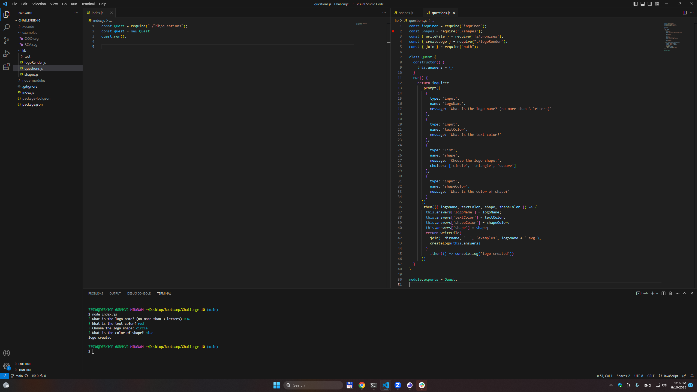

# LogoCreator
  
  ## Description
  This app make a simple logo. You can choose name, shape and colors of logo
  ## Table of Contents
- [Installation](#installation)
- [Usage](#usage)
- [Iicense](#Iicense)
- [How to contribute](#how-to-contribute)
- [Tests](#tests)
- [Questions](#questions)
## Installation
no installation needed
## Usage
Run index.js and answer qustions

  
## Iicense
None
## How to contribute
N/A
## Tests
N/A
## Questions
* Github: https://github.com/Unk171/Logo-Creator
* You can send your questions to my e-mail: 7353687@gmail.com
* Video: https://drive.google.com/file/d/1pWk7viR82MhbbHxKIoLnNAxFaLuRY9Lb/view
  